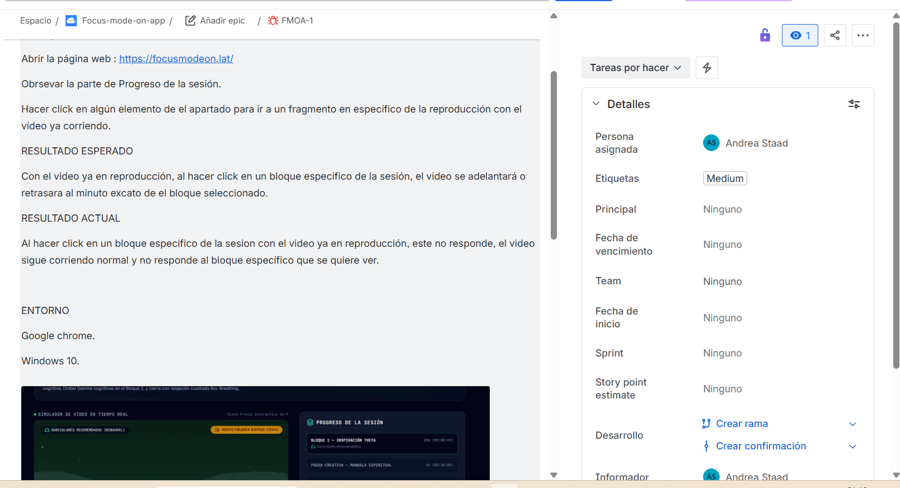
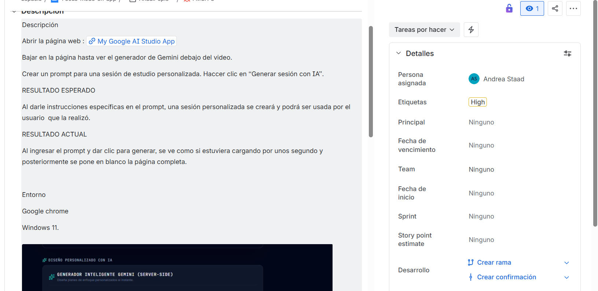
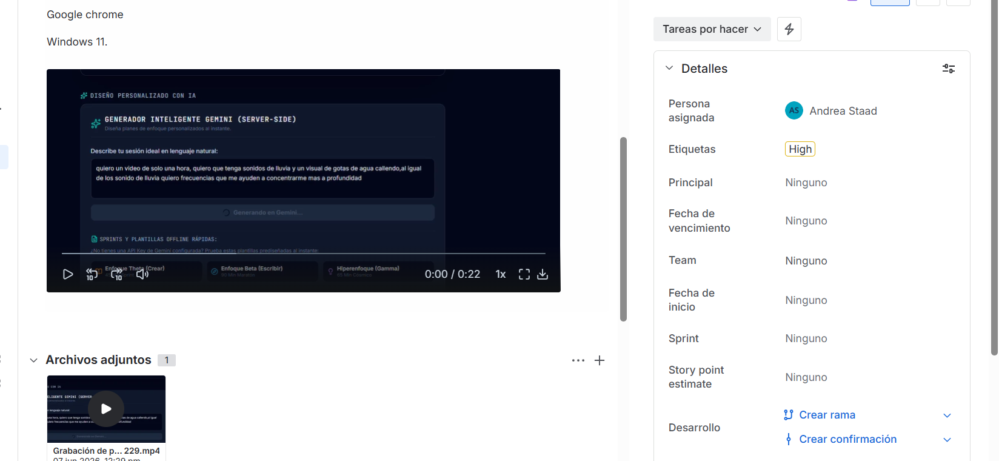
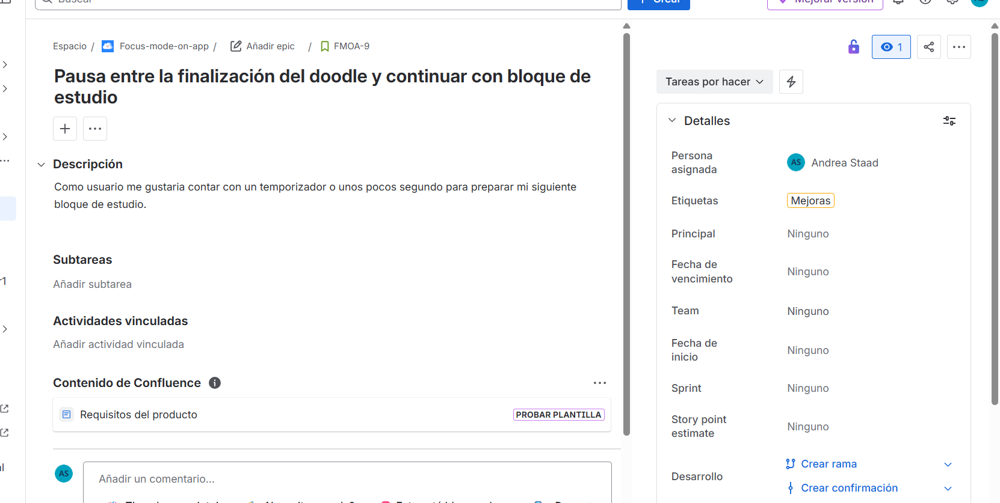

# Andrea Guerra — QA Engineer Portfolio

## Sobre mí
Holaaa!
Mi nombre es Andre Guerra , soy Inegiera en QA Juniro especializada en purebas manuales, pruebas de API, pruebas móbiles y de web.
Este repósitorio cuena con algunos de mis proyectos QA como pruebas, su documentación, ejecicios de automatización de APIs, reportes de error entre otros.

Skills

✔ Functional Testing

✔ Regression Testing

✔ Exploratory Testing

✔ API Testing

✔ Mobile Testing

✔ Web Testing

✔ SQL

✔ Postman

✔ Jira

✔ Python

✔ Pytest

📧 andreadelaluz.g.v@gmail
🔗 [LinkedIn](www.linkedin.com/in/andrea-de-la-luz-guerra-vázquez)
🌐 [focusmodeon.lat](https://focusmodeon.lat)

---
## PROYECTS 

###  Focus Mode On — Pruebas Exploratorias
Aplicación web de concentración con frecuencias binaurales, doodle guiado y box breathing.

**App en producción:** https://focusmodeon.lat
**Repositorio del proyecto:** https://github.com/andreastaad-bit/Focus-mode-on

#### Resumen de hallazgos
| Tipo | Cantidad |
|---|---|
| 🐛 Bugs encontrados | 7 |
| 📋 Mejoras identificadas | 6 |
| 🔴 Severidad Alta | 2 |
| 🟡 Severidad Media | 5 |

#### Evidencias

---

### 2. Pruebas de API — JSONPlaceholder
Pruebas funcionales sobre una API REST pública usando Postman.

**API probada:** https://jsonplaceholder.typicode.com

#### Resumen de pruebas
| Tipo | Cantidad |
|---|---|
| ✅ Casos PASS | 7 |
| ❌ Casos FAIL | 3 |
| Métodos probados | GET, POST, PUT, PATCH, DELETE |
| Endpoints probados | /posts, /todos, /comments |

#### Hallazgos principales
- API acepta `PUT` sin body y responde `200 OK` — debería retornar `400 Bad Request`
- API acepta `PATCH` sin body y responde `200 OK` — debería retornar `400 Bad Request`
- API no valida campos requeridos en requests incompletos

#### Archivos
- [Casos de prueba completos](02-api-testing/QA_PORTFOLIO_ANDREA.xlsx)

---

## Herramientas

